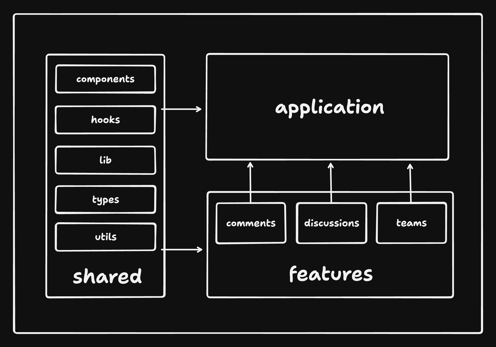

# Folder structure

## The idea
I mostly followed the bulletproof react folder structure, since it's opinionated and depurated during years.

## The structure

A brief explanation of the folder structure:

- app: where the application layer lies. It includes pages, router configuration and providers

  

- assets: static files using in the app.
- components: shared components, such as utility components or UI components

  

- features: feature based modules. Only two in our case: Planets and Residents. More details on this folder at the end of the document.
- graphql: for shared graphql queries.
- lib: for shared libs. The only one used is the apollo-client.
- store: the folder for our global store.
- testing: a folder for shared testing things such as mocks, setup files, etc.
- types: for shared types. Planet type is here because it's needed in more places that in its feature folder.
- utils: a place for small libraries we could need.

## About the `features` folder

For having a more organized project structure I decided to put most of the code in the features folder. Each folder should contain code that's specific to that feature, separated in a open number of folders. This way we avoid mixing things and improves the maintainability of the project.

