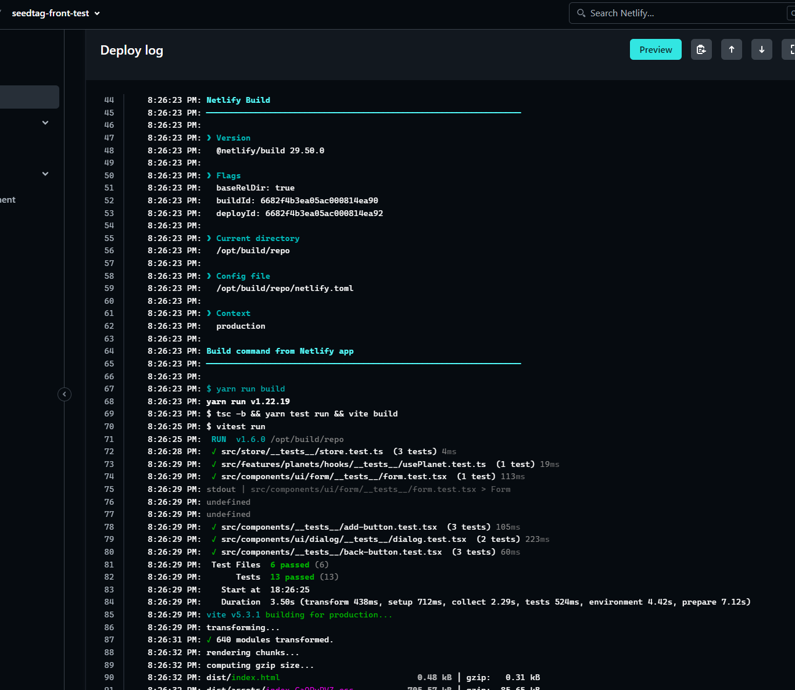

## Notes

I would like to note some considerations taken during the process of this tech test.

## The API is only a set of getters

Since the provided api only has getter methods, and no way to work with the list of planets directly from the api. That was a problem from start because didn't have a clear idea about what was the best and faster solution.

## Zustand as source of truth

I decided to bring all the planets and manage them at Zustand level.  This way I can work with the planet list without the hassle of having 2 different data sources and doing juggles trying to give them some sense.

This solution is feasible because the data provided by the api is small (only 60 planets AFAIK), but with a larger amount of data (and way more time) a small backend with a database could be a better idea.

As a said, due to the time I had and the scope of the tech test itself, I decided to go that way.

## The rest api have not an option to get all the planets (oh no)

After deciding to go with the Zustand solution I saw that the rest API had NO option to return all planets, despite having a `getPlanets` call. It was always paginated whatever you do.

At first I thought of retrieving all the pages one by one with a recursive call [(in fact, I did it)](https://github.com/usersaurus/seedtag-tech-test/commit/3e099898a1f3254ef63e4744a6e337f8e3b70b91#diff-60e79904f1b7c808f99a0ace813aaaa4509d813c85c0bc927d3294c000bbeb6f), but that solution was ugly and prone to errors.

Taking a look at the graphql api I saw that there you could retrieve all planets with a single petition, so [I pivoted in that direction](https://github.com/usersaurus/seedtag-tech-test/commit/ff17f347a5144d68eb1bb60f19a1eaaa3ed37dd3)

## Automatic deploys with Netlify

An automatic deploy triggers everytime I push anything to the main branch. It also runs all the tests before deploying anything, and things are only published when everything is green.

