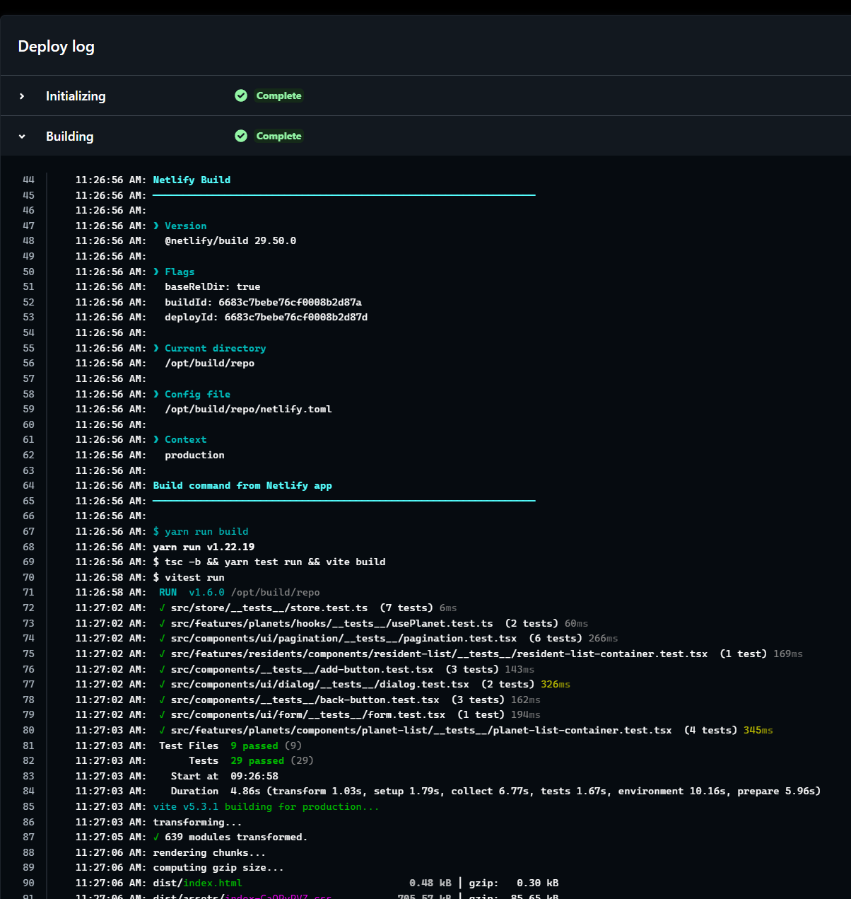

## Notes

I would like to note some considerations taken during the process of this tech test.

## The API is only a set of getters

Since the provided api only has getter methods, and no way to work with the list of planets directly from the api. That was a problem from start because didn't have a clear idea about what was the best and faster solution.

## Zustand as source of truth

I decided to bring all the planets and manage them at Zustand level.  This way I can work with the planet list without the hassle of having 2 different data sources and doing juggles trying to give them some sense.

This solution is feasible because the data provided by the api is small (only 60 planets AFAIK), but with a larger amount of data (and way more time) a small backend with a database could be a better idea.

As a said, due to the time I had and the scope of the tech test itself, I decided to go that way.

## The rest api have not an option to get all the planets (oh no)

After deciding to go with the Zustand solution I saw that the rest API had NO option to return all planets, despite having a `getPlanets` call. It was always paginated whatever you do.

At first I thought of retrieving all the pages one by one with a recursive call [(in fact, I did it)](https://github.com/usersaurus/seedtag-tech-test/commit/3e099898a1f3254ef63e4744a6e337f8e3b70b91#diff-60e79904f1b7c808f99a0ace813aaaa4509d813c85c0bc927d3294c000bbeb6f), but that solution was ugly and prone to errors.

Taking a look at the graphql api I saw that there you could retrieve all planets with a single petition, so [I pivoted in that direction](https://github.com/usersaurus/seedtag-tech-test/commit/ff17f347a5144d68eb1bb60f19a1eaaa3ed37dd3)

## Resident lists are not being fetched in advance

Since it was the only oportunity to show some async data management, I thought it could be a good idea to fetch the residents list to the graphQL api only when needed. That's why it take some time to show it, but it's fast anyway, and the loading process is under a skeleton animation, so it's kinda cool.

## The usePlanets hook

Instead of directly using the store, I thought it could be a good idea to create a custom hook for scoping parts of the store at feature level. This way we can manage, for example, related store things of a feature in a cleaner way.

Apart from that, the usePlanet hooks manages any needed transformation, keeping or store decoupled of specific feature needs.

## Tests

There are a good number of tests of different types and complexities, but not all components were covered because of time constraints.

## Styles

Most of the styles are added using the props of Radix UI components, but in the cases where styles were longer than I think they should be for a JSX, like the styles of the form component.

Anyway, I do not have a strong position on this and only took this approach because I thought it could be the fastest and cleanest one for the tech test needs.

## Automatic deploys with Netlify

An automatic deploy triggers everytime I push anything to the main branch. It also runs all the tests before deploying anything, and things are only published when everything is green.

